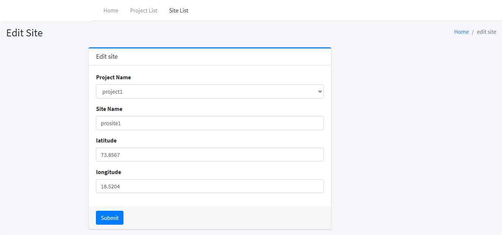

# osmapp

## Description
osmapp is an open street map layer.

## Prerequisites
1. Nodejs v12
2. Angular 9

## Tech Stack
1. Angular 9
2. NodeJs  v12
3. Mongo db

## Steps - api
1. git clone https://github.com/thiyagu241989/osmapp
2. cd osmapp/api
3. `npm i ` to install the dependencies.
4. `npm run dev` to run the apis

## Steps - Frontend
1. cd osmapp/angular
2. `npm i` to install dependencies
3. To run it in development mode use, `npm start`.

## Screenshots

### dashboard

### create project

### projectlist

### site list

### edit site

### dashboard with map

